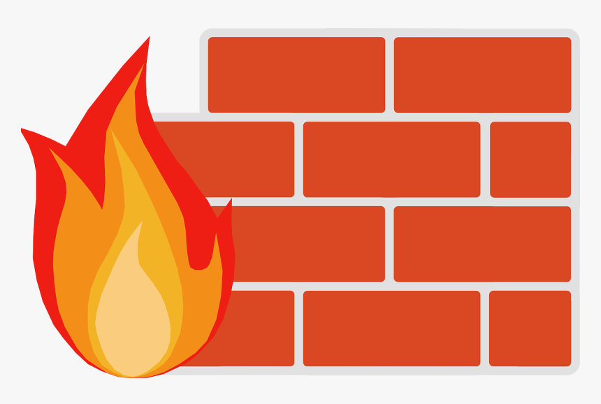

# 📚 🐣 Firewall Installer Raspbian



[](https://choosealicense.com/licenses/mit/)

Installer for firewall rules and iptables

- Rasbian configuration
- iptables definitions
- DNS server configuration & installer

RASPBIAN 🥤


## Installation

Install firewall with different steps

```bash
  ./firewall install
  
   -> The code execute here is to install depiencies

  ./firewall configure

   -> configure the iptables and the DNS server
```

## Configuration

Configure firewall with different scripts

```bash
    ./udhcp.sh
  
   -> The code execute here is to restart the udhcp server

  ./firewall_script_exec.sh

   -> configure the iptables and make it persisent
```

## To have more

On Raspbian you can install webmin to check your firewall utilisation and stats

For that you can install and configure it with

```bash
    ./webmin.sh
```


## Authors

- [@ZeroJnr](https://www.github.com/Liam-Esteffe)

